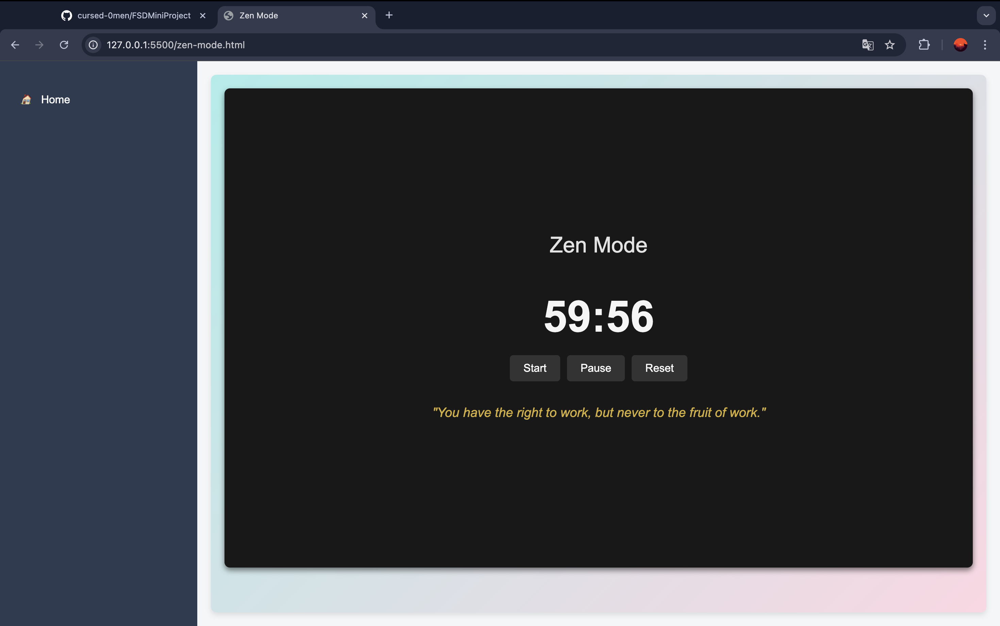

# 📝 Task Manager

## Overview
A streamlined web-based **Task Manager** designed to efficiently organize tasks, track habits, and enhance productivity with an immersive **Zen Mode**.

## Features
- ✅ **To-do List**: Add, mark, and delete tasks with priority settings.
- 📅 **Habit Tracker**: Track progress through an intuitive calendar and Gantt chart.
- 🧘‍♂️ **Zen Mode**: A focus timer complemented by motivational quotes.
- 🎨 **Welcome Screen**: A visually stunning and user-friendly introduction.

## Tech Stack
- **Frontend**: HTML5, CSS3, JavaScript, Bootstrap
- **Backend**: Node.js, Express.js, MongoDB

---

